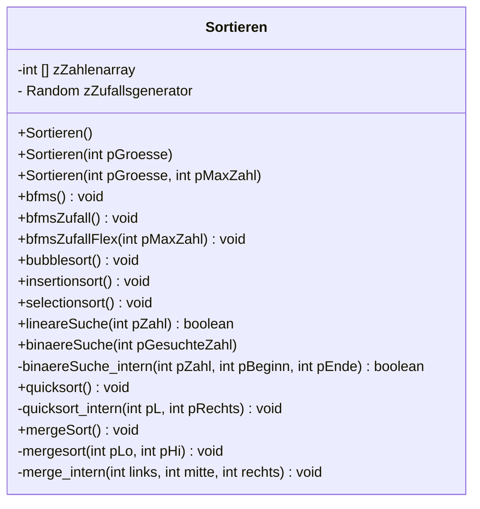

# Suchen und Sortieren auf der linearen Datenstruktur Array
Im Rahmen dieser Einheiten beschäftigen wir uns mit dem Suchen und Sortieren von Objekten. Der Einfachheit halber werden wir uns am Anfang auf das Sortieren von Zahlen beschränken, wobei jedes Objekt sortiert bzw. gesucht werden kann, wenn ein Suchkriterium vorliegt.
## UML Diagramm zum Projekt
Das unten stehende UML Diagramm dient als Vorlage.


:::alert{info}
## Aufgabe(n)
1. Erstelle eine Arbeitskopie des Projekts. Eine Arbeitskopie des Projekts kannst du unter https://edugit.org/abitur-2024/01-suchen-und-sortieren-abi-2024.git mit BlueJ auschecken. 
2. Kopiere die Vorlagenklasse unter deinem Namen z.B.: Sortieren_Ulf in dasselbe Projekt.
3. Implementiere zuerst die Methoden, die **kein** Sortier- oder Suchalgorithmus sind. Was die einzelnen Methoden leisten sollen, steht in den Methodenkommentaren!
4. Teste deine Implementationen, indem du die erzeugten Objekte inspiziert. Ist das Array immer den Anforderungen entsprechend gefüllt?
5. Commitet, pusht und aktualisiere deine Implementation. 
6. Fertigt mit dem Struktogrameditor der Uni Dresden Struktogramme zu den einfachen Sortieralgorithmen: Bubble-, Insertion- und Selectionsort an und speichere sowohl eine Bilddatei als auch eine .json Datei deines Struktograms.
7. Nutze den Quellcodeexport und **teste** deine Exporte in **deiner** Klasse. Sollte etwas nicht funktionieren, verbessere es und passe auch deine Struktogramme dementsprechend an.
8. Commitet, pusht und aktualisiere deine Implementation. 
9. Fahre nach demselben Vorgehen (6-8) mit den beiden Suchmethoden (lineare Suche und binäre Suche) fort. Hilfestellungen findest du wieder in den Methodendokumentationen.
10. Fahre nach demselben Vorgehen (6-8) mit den beiden rekursiven Sortiermethoden (Quicksort und Mergesort) fort. Hilfestellungen findest du wieder in den Methodendokumentationen.
9. Beginne zum Beginn einer Stunde mit einer frischen Arbeitskopie deiner Implementation.
:::

# Suchen 
In der Informatik versteht man unter **Suchen** ein Verfahren zur Untersuchung einer Datenstruktur (in unserem Fall momentan die Datenstruktur array) auf einen **bestimmten** Inhalt.

## lineare Suche

### Erklärung:
Die **lineare Suche** ist der einfachste Suchalgorithmus überhaupt. Es wird ein Element in einer Liste oder einem Array mit **n** Elementen gesucht. Dabei ist irrelevant, ob der Array bereits sortiert ist oder nicht.

Der Suchaufwand wächst linear mit der Anzahl der Elemente. Wenn die Daten zufallsverteilt sind, dann werden im Schnitt **n/2** Vergleichsoperationen benötigt. Im besten Fall ist gleich das erste Element der Liste dasjenige, das man sucht, im schlechtesten ist es das letzte.

Wenn die Anzahl der Elemente in einer Liste klein ist, dann ist es oft auch das effizienteste Verfahren.
### Beispiel Anwendung:
| [0] | [1] | [2] | [3] | [4] | [5] | [6] | [7] | [8] | [9] | ges. Zahl |
| :-: | :-: | :-: | :-: | :-: | :-: | :-: | :-: |:-:| :-: | :-: |
| **16** | 78 | 11 | 9 | 0 | 777 | 45 | 109 | 8 | 90 | **11** |

Als Beispiel wird die Zahl **9** gesucht. angefangen wird zunächst an der Stelle 0 im Array. An dieser Stelle befindet sich die Zahl **16**, da diese nicht die gesuchte Zahl ist gehen wir ein Fach im Array weiter.

| [0] | [1] | [2] | [3] | [4] | [5] | [6] | [7] | [8] | [9] | ges. Zahl |
| :-: | :-: | :-: | :-: | :-: | :-: | :-: | :-: |:-:| :-: | :-: |
| **16** | 78 | 11 | 9 | 0 | 777 | 45 | 109 | 8 | 90 | **11** |
| ~~16~~ | **78** | 11 | 9 | 0 | 777 | 45 | 109 | 8 | 90 | **11** |

Nach der **16** kommt die **78** die ist ebenfalls noch nicht die gesuchte Zahl somit wird sich weiter bewegt.

| [0] | [1] | [2] | [3] | [4] | [5] | [6] | [7] | [8] | [9] | ges. Zahl |
| :-: | :-: | :-: | :-: | :-: | :-: | :-: | :-: |:-:| :-: | :-: |
| **16** | 78 | 11 | 9 | 0 | 777 | 45 | 109 | 8 | 90 | **11** |
| ~~16~~ | **78** | 11 | 9 | 0 | 777 | 45 | 109 | 8 | 90 | **11** |
| ~~16~~ | ~~78~~ | **11** | 9 | 0 | 777 | 45 | 109 | 8 | 90 | **11** |

Nach der **78** kommt die gesuchte Zahl **11** und die Suche ist mit der Wiedergabe der gefundenen Informationen beendet.

### Struktorgramm und Java Quellcode
::::tabs{id="Lineare Suche"}
:::tab{title="Lineare Suche" id="Struktog. lineare"}
:::
:::tab{title="Lineare Suche optimiert" id="Struktog. lineare"}
:::
:::tab{title="Java lineare Suche" id="Java lineare Suche"}
```java
   public boolean lineareSuche(int pZahl)
    {      
       boolean f = false;
       int i = zZahlenarray.length-1;
       do
       {
           if ( zZahlenarray[i] == pZahl ){
               f = true;
               i++;
           }
        }
       while (f == false);
       return f;
    }
```
:::
::::
## binäre Suche

### Erklärung:
Eine binäre Suche ist eine schnelle und effiziente Methode, um einen bestimmten Zielwert aus einer Reihe von bestellten Artikeln zu ermitteln. Indem Sie in der Mitte der sortierten Liste beginnen, können Sie den Suchraum effektiv halbieren, indem Sie anhand des Medianwerts im Vergleich zum Zielwert festlegen, ob die Liste auf- oder absteigend sein soll.

Bei der binären Suche musste das Ziel nur mit drei Werten verglichen werden. Im Vergleich zu einer linearen Suche hätte die Suche vom ersten Wert an begonnen und sich nach oben bewegt, wobei das Ziel mit acht Werten verglichen werden musste. Eine binäre Suche ist nur mit einem geordneten Datensatz möglich; Wenn die Daten zufällig angeordnet sind, liefert eine lineare Suche die ganze Zeit über Ergebnisse, während eine binäre Suche wahrscheinlich in einer Endlosschleife stecken bleibt.
### Beispiel Anwendung:

# Einfache Sortieralgorithmen
## Bubblesort
### Video
::youtube[Bubblesort]{#lyZQPjUT5B4}

### Struktogramm und Java Quellcode
::::tabs{id="Bubblesort"}
:::tab{title="Struktogramm Bubblesort" id="Struktogramm Bubblesort"}


Du kannst dir das Struktorgramm auch als json Datei herunterladen. Dieses kann dann im Struktogramm Editor der  [Uni Dresden](https://dditools.inf.tu-dresden.de/ovk/Informatik/Programmierung/Grundlagen/Struktogramme.html) eingebunden und weiterverwendet werden
:download[Herunterladen]{src="./download/Bubblesort_Struktogramm.json"}
:::
:::tab{title="Java Bubblesort" id="Java Bubblesort"}
```java
   public void bubblesort()
    {   
        int hilfe = 0;
        for (int i = 0; i < zZahlenarray.length; i++)
        {
            for (int x = 0; x < zZahlenarray.length -1; x++)
            {
                if (zZahlenarray [x] > zZahlenarray [+1])
                {
                    hilfe= zZahlenarray[x+1];
                    zZahlenarray [x] = zZahlenarray[x+1];
                    zZahlenarray [x] = hilfe;
                }
            }
        }
    }
```
:::
::::

## optimierter Bubblesort

## Insertionsort
### Video
::youtube[Insertionsort]{#ROalU379l3U}
### Struktorgramm und Java Quellcode
::::tabs{id="Insertionsort"}
:::tab{title="Struktogramm Insertionsort" id="Struktogramm Insertionsort"}


Du kannst dir das Struktorgramm auch als json Datei herunterladen. Dieses kann dann im Struktogramm Editor der  [Uni Dresden](https://dditools.inf.tu-dresden.de/ovk/Informatik/Programmierung/Grundlagen/Struktogramme.html) eingebunden und weiterverwendet werden
:download[Herunterladen]{src="./download/Insertionsort_Struktogramm.json"}
:::
:::tab{title="Java Insertionsort" id="Java Insertionsort"}
```java
public void insertionsort()
{
    int hilfe = 0;
    for (int i = 0;i<zZahlenarray.length; i++)
    {
        if (zZahlenarray [i] > zZahlenarray [i+1])
        {
            hilfe = zZahlenarray[i];;
            zZahlenarray[i] = zZahlenarray[i+1];;
            zZahlenarray[i+1]= hilfe;;
            for (int j = i;j>0;j--)
            {
                if (zZahlenarray [i] < zZahlenarray [i-1])
                {
                    hilfe = zZahlenarray[i];;
                    zZahlenarray[i] = zZahlenarray[i-1];
                    zZahlenarray[i-1]= hilfe;;
                }
            }
        }
    }

}
```
:::
:::tab{title="Struktogramm Insertionsort optimiert" id="Struktogramm Insertionsort optimiert"}


Du kannst dir das Struktorgramm auch als json Datei herunterladen. Dieses kann dann im Struktogramm Editor der  [Uni Dresden](https://dditools.inf.tu-dresden.de/ovk/Informatik/Programmierung/Grundlagen/Struktogramme.html) eingebunden und weiterverwendet werden
:download[Herunterladen]{src="./download/Insertionsort_Struktogramm_optimiert.json"}
:::
:::tab{title="Java Insertionsort optimiert" id="Java Insertionsort optimiert"}
```java
public void insertionsort()
{
   for (int i = 1; i < zZahlenarray.length; i++)
    {
        int kleinereZahl = zZahlenarray[i];
        int j = i;
        while (j >0 && kleinereZahl < zZahlenarray[j-1])
        {
            zZahlenarray[j] = zZahlenarray[j - 1];;
            j--;
        }
    zZahlenarray[j] = kleinereZahl;;
    }
}
```
:::
::::
## Selectionsort
### Video
::youtube[Selectionsort]{#Ns4TPTC8whw}
### Struktorgramm
### Java Quellcode

# Rekursive Sortieralgorithmen

## Mergesort
### Video
::youtube[Mergesort]{#XaqR3G_NVoo}
### Struktorgramm
### Java Quellcode

## Quicksort
### Video
::youtube[Quicksort]{#ywWBy6J5gz8}
### Struktorgramm
### Java Quellcode

# Aufwandsabschätzung

https://cryptpad.fr/sheet/#/2/sheet/view/xH9bfbaoI0-4Vb9TtHEUxhpMWZ-P63gabh4H6ZmrGy0/
