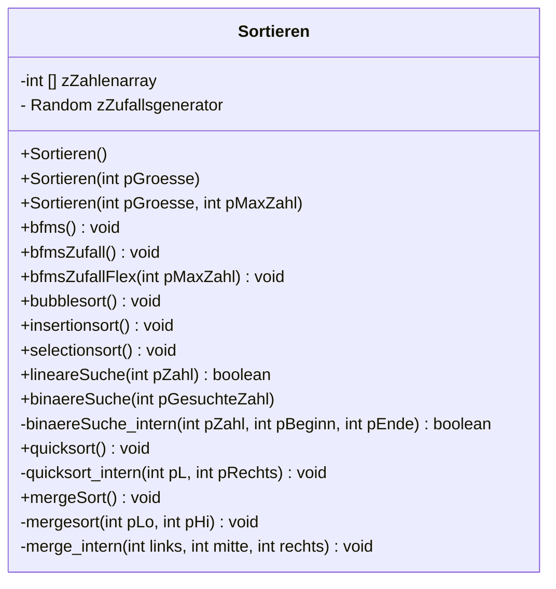

# Suchen und Sortieren auf der linearen Datenstruktur Array
Im Rahmen dieser Einheiten beschäftigen wir uns mit dem Suchen und Sortieren von Objekten. Der Einfachheit halber werden wir uns am Anfang auf das Sortieren von Zahlen beschränken, wobei jedes Objekt sortiert bzw. gesucht werden kann, wenn ein Suchkriterium vorliegt.
## UML Diagramm zum Projekt
Das unten stehende UML Diagramm dient als Vorlage.


:::alert{info}
## Aufgabe(n)
1. Erstelle eine Arbeitskopie des Projekts. Eine Arbeitskopie des Projekts kannst du unter https://edugit.org/abitur-2024/01-suchen-und-sortieren-abi-2024.git mit BlueJ auschecken. 
2. Kopiere die Vorlagenklasse unter deinem Namen z.B.: Sortieren_Ulf in dasselbe Projekt.
3. Implementiere zuerst die Methoden, die **kein** Sortier- oder Suchalgorithmus sind. Was die einzelnen Methoden leisten sollen, steht in den Methodenkommentaren!
4. Teste deine Implementationen, indem du die erzeugten Objekte inspiziert. Ist das Array immer den Anforderungen entsprechend gefüllt?
5. Commitet, pusht und aktualisiere deine Implementation. 
6. Fertigt mit dem Struktogrameditor der Uni Dresden Struktogramme zu den einfachen Sortieralgorithmen: Bubble-, Insertion- und Selectionsort an und speichere sowohl eine Bilddatei als auch eine .json Datei deines Struktograms.
7. Nutze den Quellcodeexport und **teste** deine Exporte in **deiner** Klasse. Sollte etwas nicht funktionieren, verbessere es und passe auch deine Struktogramme dementsprechend an.
8. Commitet, pusht und aktualisiere deine Implementation. 
9. Fahre nach demselben Vorgehen (6-8) mit den beiden Suchmethoden (lineare Suche und binäre Suche) fort. Hilfestellungen findest du wieder in den Methodendokumentationen.
10. Fahre nach demselben Vorgehen (6-8) mit den beiden rekursiven Sortiermethoden (Quicksort und Mergesort) fort. Hilfestellungen findest du wieder in den Methodendokumentationen.
9. Beginne zum Beginn einer Stunde mit einer frischen Arbeitskopie deiner Implementation.
:::


# Einfache Sortieralgorithmen
## Bubblesort und optimierter Bubblesort
### Video
::youtube[Bubblesort]{#lyZQPjUT5B4}
### Erklärung
### Beispiel Anwendung:
| [0] | [1] | [2] | [3] | [4] | [5] | [6] | [7] | [8] | [9] | ges. Zahl |
| :-: | :-: | :-: | :-: | :-: | :-: | :-: | :-: |:-:| :-: | :-: |
| **16** | **78** | 11 | 9 | 0 | 777 | 45 | 109 | 8 | 90 | 11 |

### Struktogramm und Java Quellcode
::::tabs{id="Bubblesort"}
:::tab{title="Struktogramm Bubblesort" id="Struktogramm Bubblesort"}


Du kannst dir das Struktorgramm auch als json Datei herunterladen. Dieses kann dann im Struktogramm Editor der  [Uni Dresden](https://dditools.inf.tu-dresden.de/ovk/Informatik/Programmierung/Grundlagen/Struktogramme.html) eingebunden und weiterverwendet werden
:download[Herunterladen]{src="./download/Bubblesort_Struktogramm.json"}
:::
:::tab{title="Java Bubblesort" id="Java Bubblesort"}
```java
   public void bubblesort()
    {   
        int hilfe = 0;
        for (int i = 0; i < zZahlenarray.length; i++)
        {
            for (int x = 0; x < zZahlenarray.length -1; x++)
            {
                if (zZahlenarray [x] > zZahlenarray [+1])
                {
                    hilfe= zZahlenarray[x+1];
                    zZahlenarray [x] = zZahlenarray[x+1];
                    zZahlenarray [x] = hilfe;
                }
            }
        }
    }
```
:::
::::

## Insertionsort
### Video
::youtube[Insertionsort]{#ROalU379l3U}
### Erklärung
Der Insertion Sort ist ein stabiler Sortieralgorhitmus. Übersetzen lässt sich Insertion Sort mit den englischen Wörtern Insertion = Einfügen und Sort = Sortieren, so mit herrscht Sortieren durch Einfügen. Es gibt einen sortierten- und unsortierten Bereich in Insertion Sort. Die erste Zahl (im Array Fach 0) gehört von Anfang an zum sortierten Bereich, daraufhin wird die nächste Zahl im unsortierten Bereich mit den Zahlen im sortierten Bereich verglichen und an die richtige Position gebracht. Dies bedeutet das der Algorhithmus in-place (weiterer Speicherplatz wird außerhalb des Arrays **nicht** benötigt) arbeitet.
### Beispiel Anwendung:
| [0] | [1] | [2] | [3] | [4] | [5] |
| :-: | :-: | :-: | :-: | :-: | :-: | 
| **16** | 78 | 11 | 9 | 0 | 777 |
| **16** | **78** | 11 | 9 | 0 | 777 |
| 16 | **78** | **11** | 9 | 0 | 777 |
| **16** | **11** | 78 | 9 | 0 | 777 |
| 11 | 16 | **78** | **9** | 0 | 777 |
| 11 | **16** | **9** | 78 | 0 | 777 |
| **11** | **9** | 16 | 78 | 0 | 777 |
| 9 | 11 | 16 | **78** | **0** | 777 |
| 9 | 11 | **16** | **0** | 78 | 777 |
| 9 | **11** | **0** | 16 | 78 | 777 |
| **9** | **0** | 11 | 16 | 78 | 777 |
| 0 | 9 | 11 | 16 | **78** | **777** |
| _0_ | _9_ | _11_ | _16_ | _78_ | _777_ |


### Struktorgramm und Java Quellcode
::::tabs{id="Insertionsort"}
:::tab{title="Struktogramm Insertionsort" id="Struktogramm Insertionsort"}


Du kannst dir das Struktorgramm auch als json Datei herunterladen. Dieses kann dann im Struktogramm Editor der  [Uni Dresden](https://dditools.inf.tu-dresden.de/ovk/Informatik/Programmierung/Grundlagen/Struktogramme.html) eingebunden und weiterverwendet werden
:download[Herunterladen]{src="./download/Insertionsort_Struktogramm.json"}
:::
:::tab{title="Java Insertionsort" id="Java Insertionsort"}
```java
    public void insertionsort()
    {
        int hilfe = 0;
        for (int i = 0;i<zZahlenarray.length; i++)
        {
            if (zZahlenarray [i] > zZahlenarray [i+1])
            {
                hilfe = zZahlenarray[i];;
                zZahlenarray[i] = zZahlenarray[i+1];;
                zZahlenarray[i+1]= hilfe;;
                for (int j = i;j>0;j--)
                {
                    if (zZahlenarray [i] < zZahlenarray [i-1])
                    {
                        hilfe = zZahlenarray[i];;
                        zZahlenarray[i] = zZahlenarray[i-1];
                        zZahlenarray[i-1]= hilfe;;
                    }
                }
            }
        }
    }
```
:::
:::tab{title="Struktogramm Insertionsort optimiert" id="Struktogramm Insertionsort optimiert"}


Du kannst dir das Struktorgramm auch als json Datei herunterladen. Dieses kann dann im Struktogramm Editor der  [Uni Dresden](https://dditools.inf.tu-dresden.de/ovk/Informatik/Programmierung/Grundlagen/Struktogramme.html) eingebunden und weiterverwendet werden
:download[Herunterladen]{src="./download/Insertionsort_Struktogramm_optimiert.json"}
:::
:::tab{title="Java Insertionsort optimiert" id="Java Insertionsort optimiert"}
```java
    public void insertionsort()
    {
    for (int i = 1; i < zZahlenarray.length; i++)
        {
            int kleinereZahl = zZahlenarray[i];
            int j = i;
            while (j >0 && kleinereZahl < zZahlenarray[j-1])
            {
                zZahlenarray[j] = zZahlenarray[j - 1];;
                j--;
            }
        zZahlenarray[j] = kleinereZahl;;
        }
    }
```
:::
::::
## Selectionsort
### Video
::youtube[Selectionsort]{#Ns4TPTC8whw}
### Erklärung
### Beispiel Anwendung:
| [0] | [1] | [2] | [3] | [4] | [5] | [6] | [7] | [8] | [9] | ges. Zahl |
| :-: | :-: | :-: | :-: | :-: | :-: | :-: | :-: |:-:| :-: | :-: |
| **16** | 78 | 11 | 9 | 0 | 777 | 45 | 109 | 8 | 90 | **11** |
### Struktorgramm und Java Quellcode
::::tabs{id="Selectionsort"}
:::tab{title="Selectionsort" id="Struktog. Selectionsort"}
:::
:::tab{title="Java Selectionsort" id="Java Selectionsort"}
```java
    
```
:::
:::tab{title="Selectionsort optimiert" id="Struktog. Selectionsort optimiert"}
:::
:::tab{title="Java Selectionsort optimiert" id="Java Selectionsort optimiert"}
```java
    
```
:::
::::

# Rekursive Sortieralgorithmen

## Mergesort
### Video
::youtube[Mergesort]{#XaqR3G_NVoo}
### Erklärung
### Beispiel Anwendung:
| [0] | [1] | [2] | [3] | [4] | [5] | [6] | [7] | [8] | [9] | ges. Zahl |
| :-: | :-: | :-: | :-: | :-: | :-: | :-: | :-: |:-:| :-: | :-: |
| **16** | 78 | 11 | 9 | 0 | 777 | 45 | 109 | 8 | 90 | **11** |
### Struktorgramm und Java Quellcode
::::tabs{id="Mergesort"}
:::tab{title="Mergesort" id="Struktog. Mergesort"}
:::
:::tab{title="Java Mergesort" id="Java Mergesort"}
```java
    
```
:::
:::tab{title="Mergesort optimiert" id="Struktog. Mergesort optimiert"}
:::
:::tab{title="Java Mergesort optimiert" id="Java Mergesort optimiert"}
```java
    
```
:::
::::

## Quicksort
### Video
::youtube[Quicksort]{#ywWBy6J5gz8}
### Erklärung
### Beispiel Anwendung:
| [0] | [1] | [2] | [3] | [4] | [5] | [6] | [7] | [8] | [9] |
| :-: | :-: | :-: | :-: | :-: | :-: | :-: | :-: |:-:  | :-: |
| 16  | 78  | 11  | 0   | 9   | 777 | 45  | 109 | 8   | 90  |
|  &#128994;  |     |     |     |&#9989;|     |     |     |     |  &#128999;  |
| 16  | 78  | 11  | 0   | 9   | 777 | 45  | 109 | 8   | 90  |
|  &#128994;  |     |     |     | &#9989;   |     |     |     |  &#128999;  |     |
| 8   | 78  | 11  | 0   | 9   | 777 | 45  | 109 | 16  | 90  |
|     |  &#128994;  |     |     | &#9989;   |     |     |     |   &#128999; |     |
| 8   | 78  | 11  | 0   | 9   | 777 | 45  | 109 | 16  | 90  |
|     |  &#128994;  |     |     | &#9989;   |     |     | &#128999;   |     |     |
| 8   | 78  | 11  | 0   | 9   | 777 | 45  | 109 | 16  | 90  |
|     |  &#128994;  |     |     | &#9989;   |     |  &#128999;  |     |     |     |
| 8   | 78  | 11  | 0   | 9   | 777 | 45  | 109 | 16  | 90  |
|     |  &#128994;  |     |     | &#9989;   |   &#128999; |     |     |     |     |
| 8   | 78  | 11  | 0   | 9   | 777 | 45  | 109 | 16  | 90  |
|     |  &#128994;  |     |     | &#9989; &#128999; |     |     |     |     |     |
| 8   |  9  | 11  | 0   | 78  | 777 | 45  | 109 | 16  | 90  |
|     |  &#128994; &#9989;|     |     |  &#128999;  |     |     |     |     |     |
| 8   |  9  | 11  | 0   | 78  | 777 | 45  | 109 | 16  | 90  |
|     |  &#128994; &#9989;|     |  &#128999;  |     |     |     |     |     |     |
| 8   |  0  | 11  | 9   | 78  | 777 | 45  | 109 | 16  | 90  |
|     |  &#128994;  |     |  &#9989; &#128999;|     |     |     |     |     |     |
| 8   |  0  | 11  | 9   | 78  | 777 | 45  | 109 | 16  | 90  |
|     |     |  &#128994;  |  &#9989; &#128999;|     |     |     |     |     |     |
| 8   |  0  | 9   | 11  | 78  | 777 | 45  | 109 | 16  | 90  |
|     |     | &#128994; &#9989; |    &#128999;|     |     |     |     |     |     |
| 8   |  0  | 9   | 11  | 78  | 777 | 45  | 109 | 16  | 90  |
|     |     |&#128994; &#9989; &#128999;|     |     |     |     |     |     |     |


Legende:

Links: &#128994;

Pivot: &#9989; &#9989;

Rechts: &#128999;


### Struktorgramm und Java Quellcode
::::tabs{id="Quicksort"}
:::tab{title="Quicksort" id="Struktog. Quicksort"}
:::
:::tab{title="Java Quicksort" id="Java Quicksort"}
```java
    
```
:::
:::tab{title="Quicksort optimiert" id="Struktog. Quicksort optimiert"}
:::
:::tab{title="Java Quicksort optimiert" id="Java Quicksort optimiert"}
```java
    
```
:::
::::
# Aufwandsabschätzung

https://cryptpad.fr/sheet/#/2/sheet/view/xH9bfbaoI0-4Vb9TtHEUxhpMWZ-P63gabh4H6ZmrGy0/
