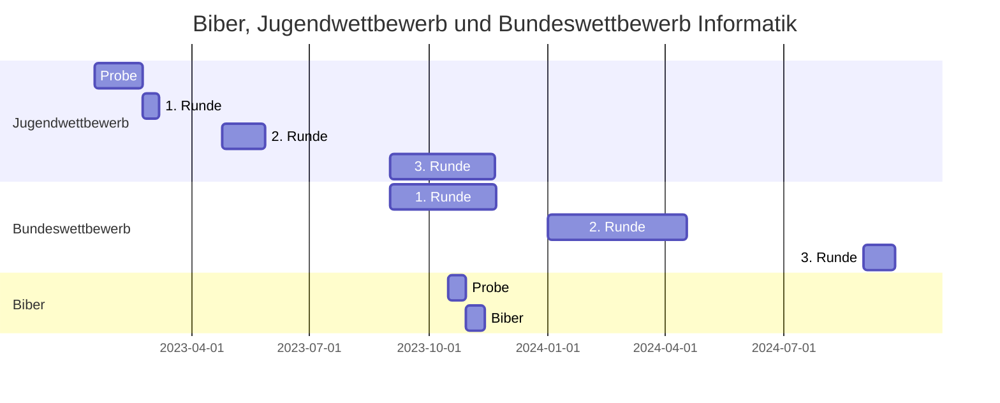

# Informatikwettbewerbe
Das folgende Diagramm gibt eine zeitliche Übersicht der Wettbewerbe.

  
## Informatikbiber
## Jugendwettbewerb Informatik
Der Jugendwettbewerb Informatik richtet sich an alle Schüler:innen ab der Jahrgangsstufe 5 und somit können bis auf die Schüler:innen der Q2 alle Schüler des FRGs an diesem Wettbewerb teilnehmen.

Die Aufgaben des laufenden Jugendwettbewerb und Bundeswettbewerbs Informatik findet ihr hier.
:download[Herunterladen]{src="/download/wettbewerbe/Bundeswettbewerb_41_Aufgabenblatt_WEB.pdf"}

Der Wettberb ist so gestaltet, dass er **nicht** im Rahmen des Unterrichts ausgeführt wird und von euch in eurer Freizeit absolviert werden muß.

Die Veranstalter des Wettbewerbs stellen eine eigene Plattform für die ersten beiden Runde zur Verfügung und haben ein eigenes Arbeitsheft zur Unterstützung und zum Selbststudium zur Verfügung gestellt, welches hier heruntergeladen werden kann.
:download[Herunterladen]{src="/download/wettbewerbe/Algorithmen-Arbeitsheft.pdf"}

Außerdem besteht die Möglichkeit sich unter https://jwinf.de Trainingsaufgaben anzuschauen und zu lösen.

Unter "Aktuelle Wettbewerbe" findet ihr den Zugang zum Probewettbewerb, für den ihr einen Zugang benötigt (siehe **Teilnahme**)

Trainingsaufgaben findet ihr unter **Trainingsaufgabe** und **Herausforderungen**.

### Teilnahme
Wer teilnehmen möchte, wendet sich bitte an:
sebastian.horn(a)schule.duesseldorf.de (das (a)steht für @).

Vertiefende Informationen findet ihr auf der Seite des Wettbewerbs: https://bwinf.de/jugendwettbewerb/2023/

:::alert{info}
**Jugendwettbewerb 2023**

10. Januar: Beginn der Anmeldung

16. Januar bis 23. Februar Probewettbewerb

27. Februar bis 10. März: 1. Runde

24. April bis 8. Mai: 2. Runde

1. September bis 20. November: 3. Runde
:::

## Bundeswettbewerb Informatik

> Drei Runden

> Der Wettbewerb beginnt am 1. September, dauert etwa ein Jahr und besteht aus drei Runden. In der 1. und 2. Runde werden zu Hause zu bearbeitet. Dabei können die Aufgaben der 1. Runde ohne größere Informatikkenntnisse gelöst werden; die Aufgaben der 2. Runde sind deutlich schwieriger. In der 1. Runde ist Gruppenarbeit zugelassen und erwünscht. An der 2. Runde dürfen jene teilnehmen, die allein oder zusammen mit anderen wenigstens drei Aufgaben weitgehend richtig gelöst haben. In der 2. Runde ist dann selbstständige Einzelarbeit gefordert. Die Bewertung erfolgt durch eine relative Platzierung der Arbeiten. Die zweite Runde beginnt Ende Dezember und die 3. Runde, die Endrunde, folgt dann Anfang September des Folgejahres.

>Die Endrunde

> Die ca. dreißig bundesweit Besten werden zur dritten Runde, einem Kolloquium, eingeladen. Darin führt jeder ein Gespräch mit je einem Informatiker aus Schule und Hochschule und analysiert und bearbeitet im Team zwei Informatik-Probleme.
## Informatik Olympiade