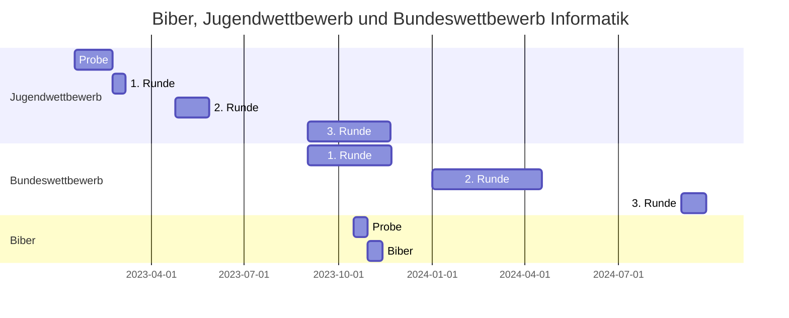

# Informatikwettbewerbe
Das folgende Diagramm gibt eine zeitliche Übersicht der Wettbewerbe.

  
## Informatikbiber
## Jugendwettbewerb Informatik
## Bundeswettbewerb Informatik
## Informatik Olympiade